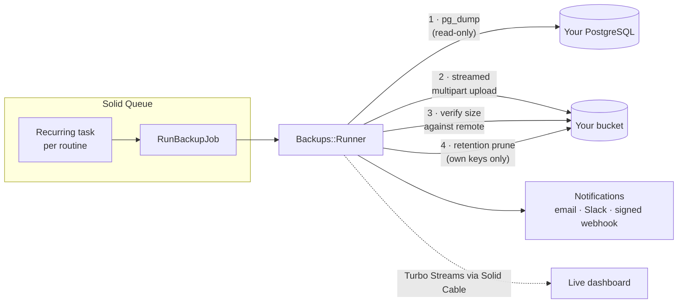

<div align="center">

# VitaPG

Self-hosted backup manager for PostgreSQL.

Scheduled `pg_dump` backups uploaded to your own S3-compatible storage, with verification,
retention policies, notifications, a live dashboard and team workspaces. MIT licensed.

[](https://github.com/bruno-berchielli/VitaPG/actions/workflows/ci.yml)
[](MIT-LICENSE)


</div>

VitaPG only backs up PostgreSQL. You install it on a server, connect the databases you want to protect, and it runs `pg_dump` on a schedule, uploads the file to a bucket you own, checks the upload, applies your retention policy and tells you when something goes wrong.

---

## Table of contents

- [Quick tour](#quick-tour)
- [Features](#features)
- [Screenshots](#screenshots)
- [How it works](#how-it-works)
- [Tech stack and dependencies](#tech-stack-and-dependencies)
- [Quick start (Docker)](#quick-start-docker)
- [Configuration](#configuration)
- [Development setup](#development-setup)
- [Testing](#testing)
- [Production notes](#production-notes)
- [Security](#security)
- [Webhook signature verification](#webhook-signature-verification)
- [Retention](#retention)
- [Internationalization](#internationalization)
- [Contributing](#contributing)
- [License](#license)

---

## Quick tour

Ten seconds of the app: dashboard, routines, then a manual backup of a 10M-row database. The run page updates over WebSockets while it dumps and uploads, and the log streams in without a page reload.

<div align="center">

</div>

## Features

Backups:
- Scheduled routines with frequency presets ("Every day at 03:00", "Weekdays", "Every 6 hours") or any cron expression, per-routine timezone. Scheduling runs on Solid Queue recurring tasks, so it survives restarts and needs no Redis.
- All three `pg_dump` formats: custom (compressed, restored with `pg_restore`), plain SQL (restored with `psql`) and directory with parallel jobs for large databases. Compression levels 0–9, table and data exclusions, `--no-owner`, `--no-privileges`.
- Uploads stream to the destination with multipart; memory use doesn't depend on database size.
- After each upload the remote object size is compared with the local artifact before the run is marked completed.
- Every routine has a "Run now" button, and every run shows a restore command matching its format.

Storage:
- Amazon S3 and S3-compatible services: MinIO, Cloudflare R2, Backblaze B2, Wasabi, DigitalOcean Spaces, etc.
- Retention per routine: keep the last N backups and/or delete backups older than X days. Pruning only deletes objects VitaPG created, identified by the exact key recorded for each run.

Monitoring:
- Dashboard with protected data total, 30-day success rate and recent failures; run pages update in real time.
- Notifications by email, Slack/Discord/Mattermost webhook, or signed webhooks (HMAC-SHA256) with automatic retries. Failures notify by default, successes are opt-in.
- Missed-schedule detection: an hourly check compares each routine's cron with its actual runs and alerts if a scheduled backup never started.
- Size anomaly warnings when a backup deviates a lot from the routine's recent average.

Teams:
- Workspaces group databases, destinations, routines and members.
- A workspace directory: everyone can see the list and request to join; workspace admins approve or deny.
- Roles (owner, admin, member) plus an instance-level superadmin with access to every workspace. Invitations by email; at least one owner per workspace.
- Sign-in without passwords: emailed magic links, or Google OAuth with optional domain whitelisting.
- Interface in English, Portuguese (Brazil) and Spanish, light and dark themes.

## Screenshots

| Dashboard (light) | Routine builder |
|---|---|
|  |  |

| Run detail with restore command | Routines |
|---|---|
|  |  |

| Notification channels | Activity bell |
|---|---|
|  |  |

## How it works



Each run is a state machine (`pending → dumping → uploading → completed | failed`) persisted with structured logs. Jobs are idempotent and safe to retry. External commands run with a wall-clock timeout and are killed by process group if they exceed it. Credentials are passed to `pg_dump` through the child process environment only, never as arguments and never in logs. An hourly job computes each routine's last expected fire time from its cron and sends a `backup.missed` alert if no run exists after it.

## Tech stack and dependencies

The whole platform is a single Rails monolith:

| Layer | Choice | Notes |
|---|---|---|
| Framework | Ruby 4.0, Rails 8.1 | |
| App database | SQLite | No external database to operate; the `storage/` folder holds all state |
| Jobs / cache / websockets | Solid Queue, Solid Cache, Solid Cable | Persistent queues and pub/sub over SQLite, no Redis |
| Frontend | Hotwire (Turbo + Stimulus), ViewComponent, Tailwind 4 | Server-rendered, live updates, no SPA |
| Storage client | aws-sdk-s3 | Streaming multipart uploads, works with any S3-compatible endpoint |
| Auth | Devise (passwordless), optional Google OAuth | Sign-in by emailed magic link; no passwords, no self-registration |
| Scheduling | Fugit | Cron parsing, validation and fire-time math |
| Binaries | `pg_dump` / `psql` | Client version should be ≥ your newest server |

Besides its own SQLite files, the only databases VitaPG connects to are the PostgreSQL servers you back up, read-only, through `pg_dump` and `SELECT 1`.

## Quick start (Docker)

The image includes PostgreSQL 18 client tools (a newer `pg_dump` can back up older servers, down to 9.2).

```bash
docker build -t vitapg .
docker volume create vitapg-storage
docker run -d --name vitapg -p 80:80 \
  -e SECRET_KEY_BASE=$(openssl rand -hex 64) \
  -e APP_HOST=backups.example.com \
  -v vitapg-storage:/rails/storage \
  vitapg
```

Set `VITAPG_SUPERADMIN_EMAIL` (add `-e VITAPG_SUPERADMIN_EMAIL=you@company.com` to the command above) and the account is created at boot; you can also run `docker exec vitapg bin/rails vitapg:superadmin EMAIL=you@company.com` later. Sign in with the magic link sent by email. Then:

1. **Databases**: add a PostgreSQL connection (a dedicated read-only role is recommended) and use *Test*. For a database that only listens on its own server, choose **SSH tunnel**: VitaPG generates a keypair, you add the public key to the server's `~/.ssh/authorized_keys`, and backups run through a forwarded port — no PostgreSQL port exposed to the internet.
2. **Destinations**: add your bucket (any S3-compatible endpoint) and use *Test*. The check is a `HEAD` request, nothing is written.
3. **Backup routines**: pick database, destination, frequency, dump options and retention. Use *Run now* for the first backup.
4. **Notifications**: add email, Slack or a signed webhook to hear about failures.

## Configuration

Everything is configured through environment variables (see `.env.example`):

| Variable | Required | Default | Purpose |
|---|---|---|---|
| `SECRET_KEY_BASE` | prod | — | Rails secrets and the key material for credential encryption. Keep it stable: rotating it invalidates stored credentials |
| `APP_HOST` | prod | `localhost` | Hostname used in emails and generated links |
| `SMTP_ADDRESS`, `SMTP_PORT`, `SMTP_USERNAME`, `SMTP_PASSWORD`, `SMTP_AUTHENTICATION` | prod | — | Outgoing mail (sign-in links, email notifications). In development the sign-in link is printed to the server log |
| `JOB_CONCURRENCY` | no | `1` | Solid Queue worker processes |
| `VITAPG_DUMP_TIMEOUT_SECONDS` | no | `21600` | Wall-clock limit for a single `pg_dump` |
| `VITAPG_SUPERADMIN_EMAIL`, `VITAPG_SUPERADMIN_NAME` | first boot | — | Creates/promotes the superadmin account at boot |
| `GOOGLE_CLIENT_ID`, `GOOGLE_CLIENT_SECRET` | no | — | Enables the "Continue with Google" button |
| `GOOGLE_ALLOWED_DOMAINS` | no | — | Comma-separated email domains allowed to auto-provision accounts via Google |
| `ACTIVE_RECORD_ENCRYPTION_*` | no | derived | Set explicitly if you plan to rotate `SECRET_KEY_BASE` independently of stored credentials |

## Development setup

Requirements: Ruby (`.ruby-version`), Node (`.node-version`), Yarn, and PostgreSQL client tools on your PATH.

```bash
git clone https://github.com/bruno-berchielli/VitaPG.git
cd VitaPG
bin/setup        # bundle + yarn + db:prepare, then boots bin/dev
```

`bin/dev` runs the web server, js/css watchers and the jobs worker under [procman](https://github.com/a-chacon/procman), a TUI process runner with real TTYs (so `binding.irb` works). It falls back to foreman if procman isn't available, and picks the first free port from 3000 up.

To try a full backup without touching real infrastructure:

```bash
docker run -d --rm --name pg -e POSTGRES_PASSWORD=test -p 55432:5432 postgres:17-alpine
docker run -d --rm --name minio -e MINIO_ROOT_USER=minioadmin -e MINIO_ROOT_PASSWORD=minioadmin \
  -p 59000:9000 quay.io/minio/minio server /data
```

Add a connection to `localhost:55432`, an S3-compatible destination pointing at `http://localhost:59000` (create the bucket first), a routine, and use **Run now**.

## Testing

```bash
bin/rails test           # unit tests
bin/rails test:system    # browser tests (headless Chrome)
bin/rubocop              # lint (rubocop-rails-omakase)

# Full pipeline against a real PostgreSQL + MinIO (same job CI runs on every PR):
INTEGRATION=1 PGPORT_INTEGRATION=55432 MINIO_PORT_INTEGRATION=59000 PGPASSWORD_INTEGRATION=test \
  bin/rails test test/integration
```

CI runs lint, Brakeman, unit and system tests, plus the integration suite against live PostgreSQL 17 and MinIO containers, so dump, upload, verification and retention are exercised on every pull request.

## Production notes

- Deploy: a [Kamal](https://kamal-deploy.org) config ships in `config/deploy.yml`; any Docker host works. One container runs web and jobs (`SOLID_QUEUE_IN_PUMA=true`); scale workers with `JOB_CONCURRENCY`.
- Persistence: back up the `storage/` volume. It holds every SQLite database (app, queue, cache, cable).
- The job dashboard at `/jobs` (Mission Control) requires a signed-in user.
- Database permissions: use a dedicated read-only role. VitaPG only runs `pg_dump` and `SELECT 1` against your servers.
- Storage permissions: scope credentials to the bucket with put/get/delete-object rights. Bucket deletion is never needed.

## Security

- Database passwords, storage keys, webhook URLs and signing secrets are encrypted at rest with Active Record Encryption. Keys derive from `SECRET_KEY_BASE` unless set explicitly.
- Secrets are write-only in the UI: stored values are never rendered back, and leaving a secret field blank on edit keeps the current value.
- Passwords reach `pg_dump` through the child process environment only: not argv (visible in `ps`), not logs, not error messages. There are tests asserting this.
- The app cannot write to a source database, and cannot delete a destination object it didn't create.
- SSH tunnels authenticate with an app-generated key (private half encrypted at rest, never shown) and pin the server's host key on first connection; a changed host key aborts the backup.
- There is no registration and there are no passwords. People sign in with a short-lived emailed link or Google (optionally restricted by domain); accounts exist only by superadmin bootstrap, workspace invitation or whitelisted Google domain.
- Brakeman runs in CI on every change.

## Webhook signature verification

Signed webhooks send `X-Vitapg-Signature: t=<unix>,v1=<hex>` where `v1 = HMAC-SHA256(signing_secret, "#{t}.#{raw_body}")`. The secret is shown on the channel's edit screen.

```ruby
def valid_vitapg_signature?(request, secret)
  timestamp, signature = request.headers["X-Vitapg-Signature"]
    .match(/t=(\d+),v1=(\h+)/)&.captures
  return false unless timestamp && signature

  expected = OpenSSL::HMAC.hexdigest("SHA256", secret, "#{timestamp}.#{request.raw_post}")
  ActiveSupport::SecurityUtils.secure_compare(expected, signature)
end
```

Events: `backup.completed` and `backup.failed` (full run payload), and `backup.missed` (missed schedule).

## Retention

- Policies are per routine: keep last N and/or max age in days. Leave both blank to keep everything.
- Pruning only considers runs recorded by that routine and deletes each object by its exact stored key, then marks the run `pruned` (the history stays).
- A failed deletion doesn't abort the batch; it's retried on the next daily sweep.
- Retention problems never mark a successful backup as failed.

## Internationalization

The interface ships in English, Portuguese (Brazil) and Spanish, including emails, schedule descriptions and forms. Language is a per-user setting, with a fallback to the browser's `Accept-Language`. All strings live in `config/locales/` and component sidecar `.yml` files; contributions adding locales are welcome.

## Contributing

Issues and pull requests are welcome. The project follows plain Rails conventions: tests with every change, code and comments in English, all UI text through I18n (en, pt-BR, es). Run `bin/rails test && bin/rubocop` before pushing; CI must be green.

## License

MIT — see [`MIT-LICENSE`](MIT-LICENSE). Created by [Bruno Berchielli](https://github.com/bruno-berchielli).
