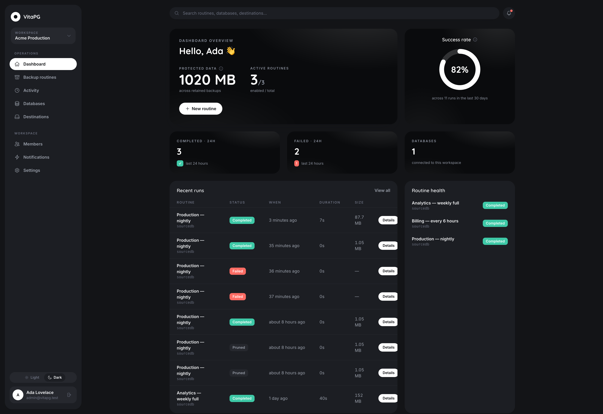
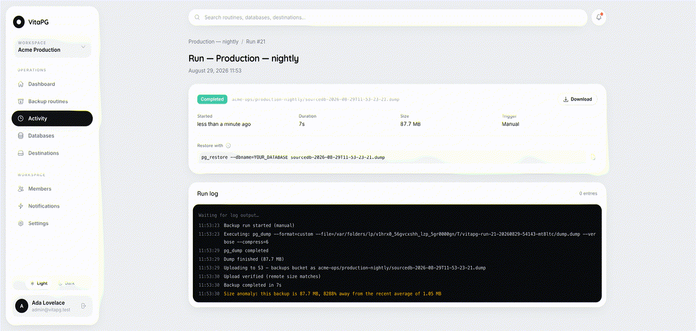
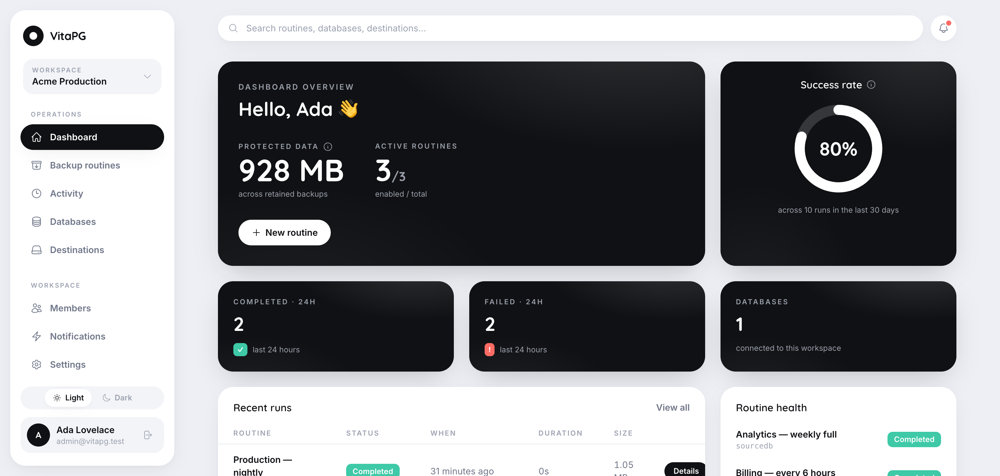
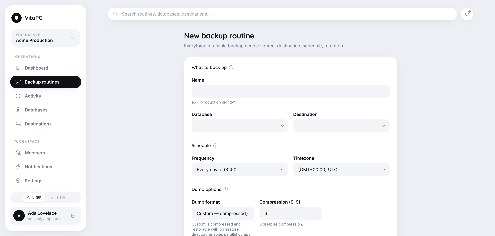
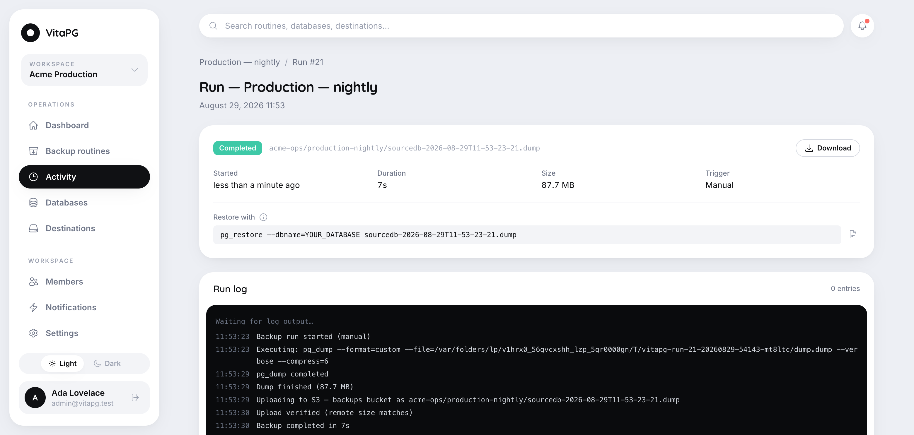
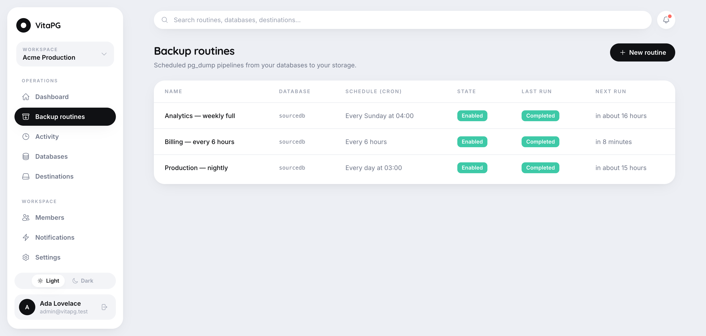
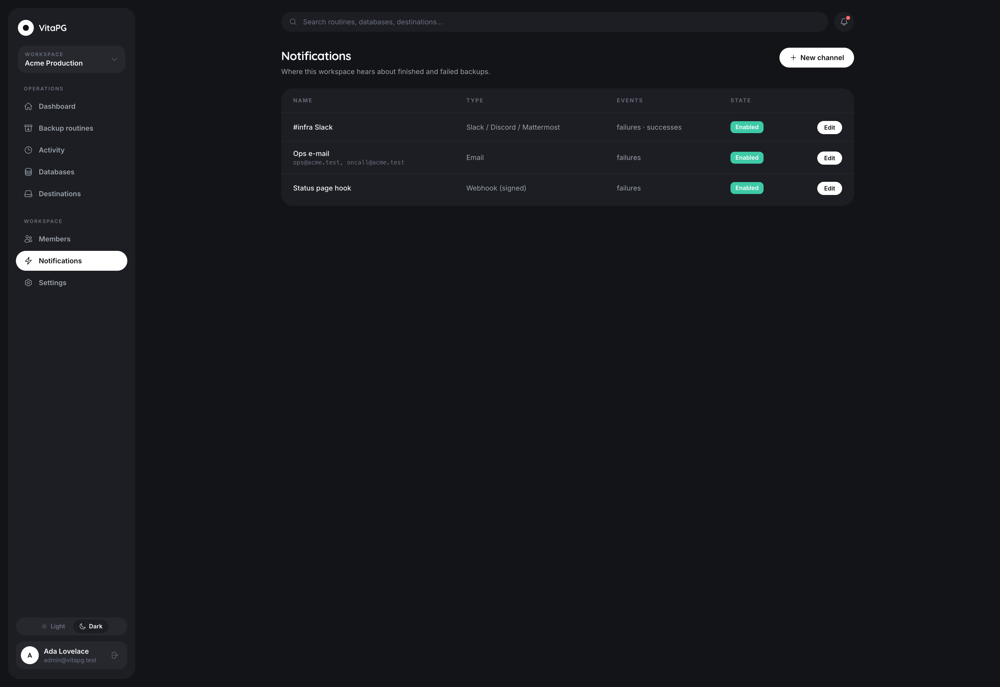
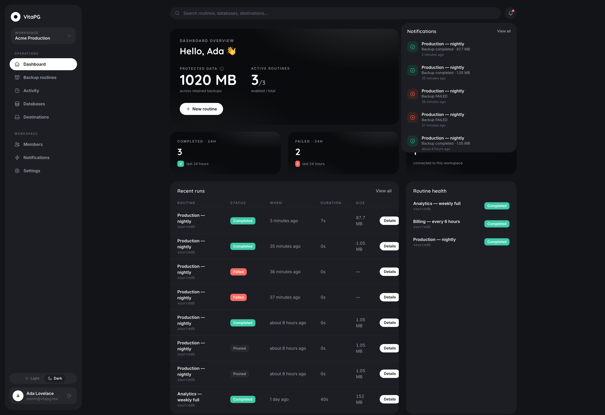
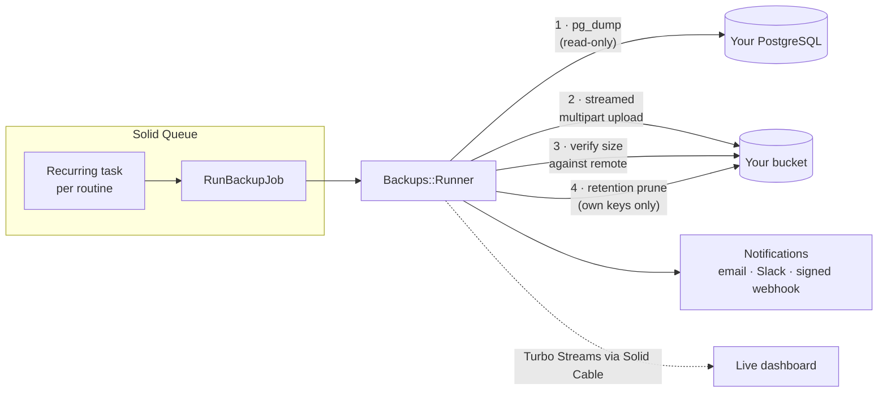

<div align="center">

# VitaPG

**Open-source, self-hosted PostgreSQL backup platform.**

Scheduled, compressed, verified backups shipped to your own S3-compatible storage —
with a live dashboard, retention policies, notifications and team workspaces.

[](https://github.com/bruno-berchielli/VitaPG/actions/workflows/ci.yml)
[](MIT-LICENSE)




</div>

VitaPG does one thing: **PostgreSQL backups**. That focus is the feature. Install it on a server, connect your databases, and every backup is dumped with `pg_dump`, streamed to your bucket, **verified against the remote object**, retained by policy, and watched by a dead-man's switch — with everything visible, live, in a dashboard your whole team can use.

---

## Table of contents

- [Watch it work](#watch-it-work)
- [Features](#features)
- [Screenshots](#screenshots)
- [How it works](#how-it-works)
- [Tech stack & dependencies](#tech-stack--dependencies)
- [Quick start (Docker)](#quick-start-docker)
- [Configuration](#configuration)
- [Development setup](#development-setup)
- [Testing](#testing)
- [Production notes](#production-notes)
- [Security model](#security-model)
- [Webhook signature verification](#webhook-signature-verification)
- [Retention semantics](#retention-semantics)
- [Internationalization](#internationalization)
- [Contributing](#contributing)
- [License](#license)

---

## Watch it work

A real backup of a 2M-row database, live in the browser — status flips `pending → dumping → uploading → completed` and log lines stream in over WebSockets (Solid Cable), no page reload:

<div align="center">

</div>

## Features

### Backups
- **Scheduled routines** — friendly frequency presets ("Every day at 03:00", "Weekdays", "Every 6 hours"…) or any raw cron expression, with per-routine timezones. Powered by Solid Queue's recurring tasks: persistent, restart-safe, no Redis.
- **pg_dump done right** — custom format (compressed, `pg_restore`-ready), plain SQL (`psql`-ready) or directory format with **parallel jobs** for large databases. Compression levels 0–9 on every format, table/data exclusions, `--no-owner`, `--no-privileges`.
- **Streaming uploads** — multipart streaming to the destination; memory use is independent of database size.
- **Verified, never trusted** — after upload, the remote object's size is checked against the local artifact before the run is marked completed.
- **Run on demand** — every routine has a "Run now" button; every run shows a copy-paste restore command matching its format.

### Storage
- **Bring your own bucket** — Amazon S3 and every S3-compatible service: MinIO, Cloudflare R2, Backblaze B2, Wasabi, DigitalOcean Spaces…
- **Retention that can't hurt you** — keep-last-N and/or max-age pruning that only ever deletes objects VitaPG itself created (tracked per run). Applied after each successful backup plus a daily sweep.

### Observability
- **Live dashboard** — protected data, success rate over 30 days, failures front and center; run pages stream status and logs in real time.
- **Notifications** — email, Slack/Discord/Mattermost, and **HMAC-signed webhooks** with automatic retries. Failures notify by default; successes are opt-in.
- **Dead-man's switch** — if a scheduled run simply never happens (crashed worker, stopped host), VitaPG notices within the hour and alerts your failure channels. Nothing errored — and you still find out.
- **Size anomaly detection** — a backup that suddenly shrinks or balloons versus its recent history gets flagged, because a small dump usually means a big problem upstream.

### Teams
- **Workspaces** — group databases, destinations, routines and members; switch or create from anywhere.
- **Roles** — owner / admin / member, invitation by email, last-owner protection.
- **Trilingual UI** — English, Português (Brasil), Español; light and dark themes.

## Screenshots

| Dashboard (light) | Routine builder |
|---|---|
|  |  |

| Run detail with restore command | Routines |
|---|---|
|  |  |

| Notification channels | Activity bell |
|---|---|
|  |  |

## How it works



Every run is a state machine (`pending → dumping → uploading → completed | failed`) persisted with structured logs. Jobs are idempotent and safe to retry; external commands run with wall-clock timeouts and process-group kill; credentials travel only through the spawned process environment — never argv, never logs. An hourly job re-derives each routine's last expected fire time from its cron and raises a `backup.missed` alert if no run exists after it.

## Tech stack & dependencies

Boring on purpose — the whole platform is a single well-tested Rails monolith:

| Layer | Choice | Why |
|---|---|---|
| Framework | **Ruby 4.0 · Rails 8.1** | Boring, batteries included |
| App database | **SQLite** | Zero external services to operate; the `storage/` folder is the whole persistence story |
| Jobs / cache / websockets | **Solid Queue · Solid Cache · Solid Cable** | Persistent queues and pub/sub on SQLite — no Redis |
| Frontend | **Hotwire (Turbo + Stimulus), ViewComponent, Tailwind 4** | Server-rendered, live-updating, no SPA |
| Storage client | **aws-sdk-s3** | Streaming multipart uploads to any S3-compatible endpoint |
| Auth | **Devise** (+ devise-i18n) | Sign-ups auto-close after the first account |
| Scheduling | **Fugit** | Cron parsing/validation and next/previous fire-time math |
| Binaries | **`pg_dump` / `psql`** (PostgreSQL client ≥ your newest server) | The only things that ever touch your databases |

The only databases VitaPG connects to besides its own SQLite files are the PostgreSQL servers you back up — read-only, via `pg_dump` and `SELECT 1`.

## Quick start (Docker)

The image ships everything, including PostgreSQL 18 client tools (a newer `pg_dump` handles older servers — down to 9.2).

```bash
docker build -t vitapg .
docker volume create vitapg-storage
docker run -d --name vitapg -p 80:80 \
  -e SECRET_KEY_BASE=$(openssl rand -hex 64) \
  -e APP_HOST=backups.example.com \
  -v vitapg-storage:/rails/storage \
  vitapg
```

Open the app, create the **first account** (it bootstraps the instance; public sign-up closes afterwards), create a workspace, and:

1. **Databases** → add a PostgreSQL connection (a dedicated read-only role is recommended) and hit *Test*.
2. **Destinations** → add your bucket (any S3-compatible endpoint) and hit *Test* — a write-free `HEAD` check.
3. **Backup routines** → pick database + destination, a frequency preset, dump options and retention. *Run now* to see the first backup stream in live.
4. **Notifications** → add email, Slack or a signed webhook so failures never go unnoticed.

## Configuration

All configuration is environment variables (see `.env.example`):

| Variable | Required | Default | Purpose |
|---|---|---|---|
| `SECRET_KEY_BASE` | prod | — | Rails secrets **and** the key material for credential encryption. Keep it stable: rotating it invalidates stored credentials |
| `APP_HOST` | prod | `localhost` | Hostname used in emails and generated links |
| `SMTP_ADDRESS` / `SMTP_PORT` / `SMTP_USERNAME` / `SMTP_PASSWORD` / `SMTP_AUTHENTICATION` | for email | — | Outgoing mail (password resets, email notifications). Unset = SMTP disabled |
| `JOB_CONCURRENCY` | no | `1` | Solid Queue worker processes |
| `VITAPG_DUMP_TIMEOUT_SECONDS` | no | `21600` | Wall-clock limit for a single `pg_dump` |
| `VITAPG_OPEN_SIGNUPS` | no | unset | Set `1` to keep public registration open after the first account |
| `ACTIVE_RECORD_ENCRYPTION_*` | no | derived | Set explicitly if you plan to rotate `SECRET_KEY_BASE` independently of stored credentials |

## Development setup

Requirements: Ruby (`.ruby-version`), Node (`.node-version`), Yarn, and PostgreSQL client tools on your PATH.

```bash
git clone https://github.com/bruno-berchielli/VitaPG.git
cd VitaPG
bin/setup        # bundle + yarn + db:prepare, then boots bin/dev
```

`bin/dev` runs web, js/css watchers and the jobs worker under [procman](https://github.com/a-chacon/procman) (a TUI runner with real TTYs, so `binding.irb` works; falls back to foreman) and picks the first free port from 3000 up.

To exercise a full backup without touching real infrastructure:

```bash
docker run -d --rm --name pg -e POSTGRES_PASSWORD=test -p 55432:5432 postgres:17-alpine
docker run -d --rm --name minio -e MINIO_ROOT_USER=minioadmin -e MINIO_ROOT_PASSWORD=minioadmin \
  -p 59000:9000 quay.io/minio/minio server /data
```

Add a connection to `localhost:55432`, an S3-compatible destination pointing at `http://localhost:59000` (create the bucket first), a routine, and hit **Run now**.

## Testing

```bash
bin/rails test           # unit tests
bin/rails test:system    # browser tests (headless Chrome)
bin/rubocop              # lint (rubocop-rails-omakase)

# Full pipeline against a real PostgreSQL + MinIO (same job CI runs on every PR):
INTEGRATION=1 PGPORT_INTEGRATION=55432 MINIO_PORT_INTEGRATION=59000 PGPASSWORD_INTEGRATION=test \
  bin/rails test test/integration
```

CI runs lint, Brakeman, unit + system tests, **and** the integration suite against live PostgreSQL 17 + MinIO containers — dump, upload, verification and retention pruning are proven on every pull request.

## Production notes

- **Deploy** — a [Kamal](https://kamal-deploy.org) config ships in `config/deploy.yml`; any Docker host works. One container runs web + jobs (`SOLID_QUEUE_IN_PUMA=true`); scale workers with `JOB_CONCURRENCY`.
- **Persistence** — back up the `storage/` volume; it holds every SQLite database (app, queue, cache, cable).
- **Job dashboard** — `/jobs` (Mission Control) requires a signed-in user.
- **Database permissions** — use a dedicated read-only role. VitaPG only ever runs `pg_dump` and `SELECT 1` against your servers.
- **Storage permissions** — scope credentials to the bucket with put/get/delete-object rights only; bucket deletion is never needed.

## Security model

- **Credentials encrypted at rest** — database passwords, storage keys, webhook URLs and signing secrets use Active Record Encryption; keys derive from `SECRET_KEY_BASE` (or explicit env vars).
- **Write-only secrets** — the UI never renders a stored secret back; leave a secret field blank on edit to keep it.
- **No leaks** — passwords reach `pg_dump` through the child-process environment only: never argv (visible in `ps`), never logs, never error messages (asserted by tests).
- **Never destructive** — nothing in the app can write to a source database, and nothing can delete a destination object it didn't create.
- **Closed by default** — public sign-up closes after the first account; new people join by invitation.
- Brakeman runs in CI on every change.

## Webhook signature verification

Signed webhooks send `X-Vitapg-Signature: t=<unix>,v1=<hex>` where `v1 = HMAC-SHA256(signing_secret, "#{t}.#{raw_body}")`. The secret is shown on the channel's edit screen.

```ruby
def valid_vitapg_signature?(request, secret)
  timestamp, signature = request.headers["X-Vitapg-Signature"]
    .match(/t=(\d+),v1=(\h+)/)&.captures
  return false unless timestamp && signature

  expected = OpenSSL::HMAC.hexdigest("SHA256", secret, "#{timestamp}.#{request.raw_post}")
  ActiveSupport::SecurityUtils.secure_compare(expected, signature)
end
```

Events: `backup.completed`, `backup.failed` (full run payload) and `backup.missed` (dead-man's switch).

## Retention semantics

- Policies are per routine: **keep last N** and/or **max age in days** — leave both blank to keep everything.
- Pruning only ever considers runs recorded by that routine, deleting each object **by its exact stored key** and marking the run `pruned` (history is kept).
- One failed deletion never aborts the batch; it's retried on the next sweep.
- Retention problems never mark a successful backup as failed.

## Internationalization

The UI ships in **English**, **Português (Brasil)** and **Español** — including emails, cron humanization and every form. Language is per-user (and guessable from `Accept-Language`); contributions adding locales are welcome: all strings live in `config/locales/` and component sidecar `.yml` files.

## Contributing

Issues and pull requests are welcome. Keep it boring: Rails conventions, tests with every change, English everywhere in code, all UI text through I18n (en, pt-BR, es). `bin/rails test && bin/rubocop` before pushing; CI must be green.

## License

MIT — see [`MIT-LICENSE`](MIT-LICENSE). Created by [Bruno Berchielli](https://github.com/bruno-berchielli).
